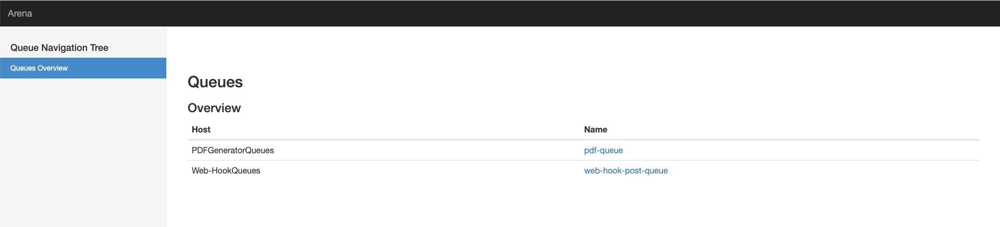
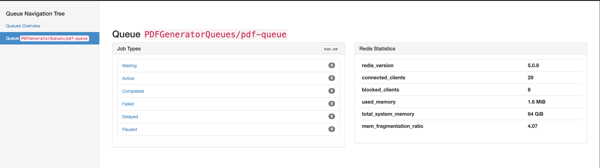
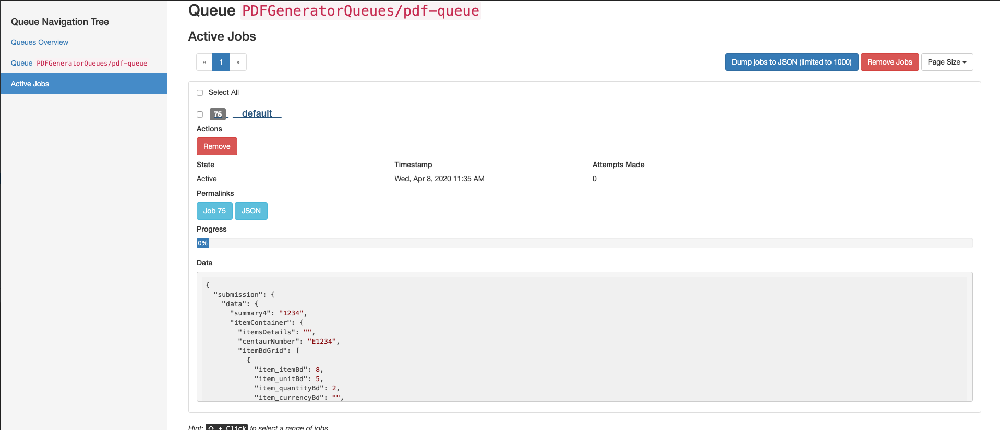
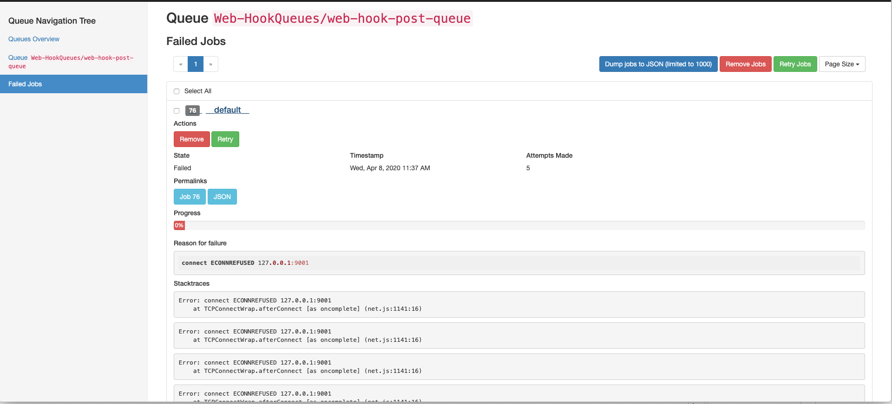

# PDF Generator

The PDF server loads job requests from Redis. You can view the jobs that are being executed, failed or delayed at

```
<SERVER>:/admin/arena
```

You will be presented with



**Please note: If you have configured pdf server with admin roles then you need the same role configured in Keycloak**

If you click into the pdf-queue you will be presented the current jobs that are being executed within that queue:



You can drill down to each job type to see the details:




If you have a failed job then you will be presented with the failure:



Failed jobs can be retried as well as seeing what the underlying issue was with the failed job.
